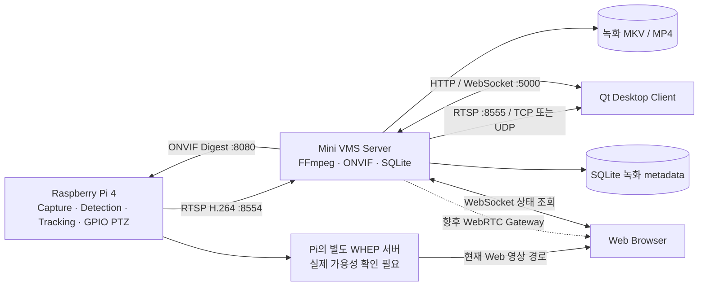
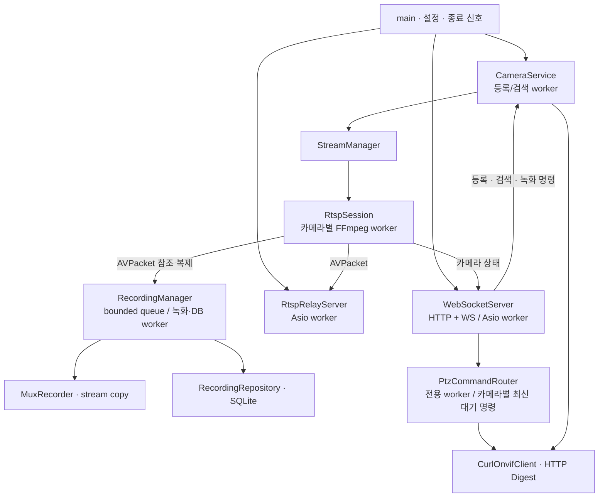

# Mini VMS Server

Raspberry Pi Edge Camera와 Qt/Web 클라이언트 사이에서 동작하는 C++17 서버 프로세스입니다. Qt GUI에 의존하지 않습니다. Pi의 H.264 RTSP 수신·재배포, 녹화·검색, ONVIF PTZ 제어를 제공합니다.

## 시스템 구조



현재 Web 영상은 VMS를 경유하지 않습니다. WebRTC Gateway는 인터페이스 단계이며, Web PTZ 요청도 현재 VMS 계약에 맞춰 수정해야 합니다.

## 현재 기능

| 기능 | 상태 |
|---|---|
| RTSP ingest | FFmpeg C API, H.264 packet 수신, TCP/UDP 선택, 재접속 |
| 카메라 관리 | ONVIF 검색·등록, cameraId별 세션·상태. 등록 정보는 메모리에서 관리 |
| RTSP relay | H.264 RTP packetization, TCP interleaved / UDP RTP·RTCP |
| 녹화 | decode/encode 없이 MKV/MP4 remux, 기본 10분 segment |
| 녹화 검색 | SQLite에서 카메라·시간 범위 검색, 최대 100개 |
| ONVIF PTZ | 서비스·프로필·좌표 조회, ContinuousMove/Stop/AbsoluteMove |
| Client API | WebSocket 명령·상태 알림, HTTP 스트림 URI 조회 |
| 이벤트·추적·WebRTC | 런타임 미구현. 별도 인터페이스로 분리 |
| 원격 녹화 재생 | 파일 전달/재생 API 미구현. Qt는 접근 가능한 로컬 파일 재생 가능 |

## 내부 구조와 스레드



main thread는 수신·저장·네트워크 I/O를 수행하지 않습니다. packet queue는 크기를 제한하고 카메라 snapshot은 mutex로 보호합니다. 진행 중인 녹화에는 `.part`가 붙으며 완료된 파일만 DB에 등록합니다.

```text
PTZ_VMS_Server/
├── CMakeLists.txt
├── cmake/              # FFmpeg SDK 검색
├── include/            # 모듈 인터페이스
├── src/
│   ├── camera/         # 검색·등록·세션 연결
│   ├── stream/         # FFmpeg ingest / RTSP relay
│   ├── recording/      # segment remux / 작업 큐
│   ├── database/       # SQLite 녹화 저장·검색
│   ├── onvif/          # Digest / SOAP adapter
│   ├── ptz/            # 명령 순서·소유권·정지
│   ├── client/         # HTTP / WebSocket
│   └── core/           # 설정·로그
├── config/             # 기본 설정 / *.local.conf
├── data/               # DB, Git 제외
├── recordings/         # 녹화 영상, Git 제외
├── tests/              # unit / 통합 테스트 / fixtures
└── docs/               # 설계·API·기술 결정
```

## 빌드와 실행

필수 dependency는 FFmpeg `libavformat/libavcodec/libavutil`, Boost headers 1.70 이상, nlohmann_json, libcurl 7.85 이상, tinyxml2, SQLite3입니다. 현재 서버 경로에는 libswscale이 필요하지 않습니다.

### Linux / WSL

Ubuntu 개발 패키지 예:

```sh
sudo apt install build-essential cmake pkg-config libavformat-dev libavcodec-dev libavutil-dev libboost-dev nlohmann-json3-dev libcurl4-openssl-dev libtinyxml2-dev libsqlite3-dev python3 ffmpeg
```

저장소 루트에서:

```sh
cmake -S . -B build -DCMAKE_BUILD_TYPE=Debug
cmake --build build --parallel 3
ctest --test-dir build --output-on-failure
```

실제 Pi용 설정 파일은 최초 한 번 복사하여 준비합니다.

```sh
cp config/vms.conf config/cam01.local.conf
```

복사한 설정에 `onvif_username`, `onvif_password`를 넣은 뒤 실행합니다. `*.local.conf`는 Git에서 제외됩니다.

```sh
./build/vms-server --config config/cam01.local.conf
```

Ctrl+C로 세션·녹화를 정상 종료합니다.

### Windows native

MSVC x64와 같은 아키텍처의 FFmpeg 개발 SDK 및 다른 dependency의 CMake package가 필요합니다. 경로는 설치 위치에 맞춰 바꿉니다.

```powershell
cmake -S . -B build-windows -G "Visual Studio 17 2022" -A x64 -DFFMPEG_ROOT="C:/deps/ffmpeg" -DCMAKE_PREFIX_PATH="C:/deps"
cmake --build build-windows --config Debug --parallel
ctest --test-dir build-windows -C Debug --output-on-failure
.\build-windows\Debug\vms-server.exe --config config/cam01.local.conf
```

사용한 라이브러리 DLL을 실행 파일 옆이나 PATH에 준비합니다. 현재 세션에서 확인한 서버 빌드/실행은 Linux/WSL 결과입니다.

## 연결 주소

| 용도 | 기본 주소 |
|---|---|
| Pi Device | `http://192.168.0.92:8080/onvif/device_service` |
| Pi PTZ | `http://192.168.0.92:8080/onvif/ptz_service` — 서비스 조회로 확인 |
| Pi 원본 영상 | `rtsp://192.168.0.92:8554/cam`, profile `main` |
| VMS HTTP | `http://127.0.0.1:5000` |
| VMS WS | `ws://127.0.0.1:5000/ws` |
| VMS RTSP | `rtsp://<VMS 호스트>:8555/CAM01` |

Pi의 RTP/RTCP `8000/8001`과 VMS relay의 UDP 포트는 별개입니다. VMS는 서버 RTP/RTCP 포트를 동적으로 할당하고 Qt 수신 포트와 SETUP에서 협상합니다.

`rtsp_url=`이 비어 있으면 Qt의 ONVIF 등록이 ingest를 시작합니다. VMS 재시작 후 다시 등록해야 합니다. Pi 원본 URI와 인증정보는 서버 내부에서 관리합니다.

Windows Qt + WSL VMS에서 UDP를 사용하려면 VMS가 반환하는 RTSP 주소에 WSL 실제 IP를 설정합니다. HTTP/WS는 localhost로 유지할 수 있습니다.

```ini
rtsp_relay_bind=<현재 WSL IPv4 주소>
rtsp_public_host=<현재 WSL IPv4 주소>
```

`hostname -I`로 확인하며 WSL 재시작으로 IP가 바뀌면 설정을 갱신하고 VMS를 재시작합니다.

## API

| 경로/명령 | 기능 |
|---|---|
| `GET /api/v1/cameras/CAM01/stream?transport=tcp` | TCP 선택 VMS-managed RTSP URI |
| `GET /api/v1/cameras/CAM01/stream?transport=udp` | UDP 선택 VMS-managed RTSP URI |
| `GET_CAMERA_LIST`, `GET_CAMERA_STATUS` | WS 목록·상태 |
| `DISCOVER_CAMERAS`, `REGISTER_CAMERA` | WS ONVIF 검색·등록 |
| `START_RECORDING`, `STOP_RECORDING`, `GET_RECORDINGS` | WS 녹화·검색 |
| `PTZ_MOVE`, `PTZ_STOP`, `PTZ_CENTER` | WS 이동·정지·중앙 |

목록/상태용 REST 경로는 아직 없으며 WebSocket을 사용합니다. 영상 미준비 상태는 HTTP 503 `STREAM_NOT_READY`입니다. 녹화 검색은 cameraId와 선택적인 `fromMs/toMs` epoch milliseconds, `limit` 1~100을 사용합니다.

```json
{"version":1,"requestId":"1","command":"REGISTER_CAMERA","deviceServiceUrl":"http://192.168.0.92:8080/onvif/device_service","profileToken":"main"}
```

```json
{"version":1,"requestId":"2","command":"PTZ_MOVE","cameraId":"CAM01","panVelocity":0.3,"tiltVelocity":0}
{"version":1,"requestId":"3","command":"PTZ_STOP","cameraId":"CAM01"}
{"version":1,"requestId":"4","command":"PTZ_CENTER","cameraId":"CAM01"}
```

클라이언트는 약 200ms마다 새 requestId로 MOVE를 갱신하고 놓으면 STOP을 전송합니다. ContinuousMove Timeout은 PT1S, VMS 갱신 lease는 600ms입니다. 연결 단절·서버 종료 시에도 Stop을 시도합니다. 진행 중인 HTTP 요청은 완료/timeout 후 Stop으로 이어집니다.

PTZ는 먼저 `type=response`, `data.phase=ACCEPTED`를 반환하고, 같은 requestId의 `PTZ_RESULT` 알림으로 `PI_ACKNOWLEDGED`, `FAILED`, `SUPERSEDED`를 전달합니다. `PI_ACKNOWLEDGED`는 ONVIF 응답 확인이며 모터 도착 완료가 아닙니다.

## 검증과 후속 작업

CTest의 unit, discovery/registration, RTSP ingest, RTSP UDP relay, WebSocket, recording, PTZ 7개 테스트가 개발 세션에서 통과했습니다. Windows Qt의 TCP/UDP 영상은 사용자가 확인했고 실제 Pi PTZ 명령 응답도 확인했습니다. 서보 하드웨어의 방향·정지·중앙 동작 검증은 다음 단계입니다.

후속 작업: 영구 카메라 등록, 이벤트·추적, 원격 녹화 재생, WebRTC Gateway, Web PTZ 계약 연동.

[전체 설계](docs/VMS_ARCHITECTURE.md) · [WebSocket 기록](docs/WEBSOCKET_API.md) · [RTSP relay 기록](docs/RTSP_RELAY_API.md) · [Pi 연결 기록](docs/CAM01_CONNECTION_TEST.md)

상세 기록에는 작성 당시 단계가 남아 있을 수 있습니다. 현재 기능은 이 README와 소스를 기준으로 확인합니다.
