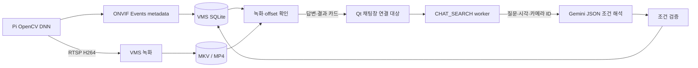

# Gemini 자연어 영상 검색

## 데이터 흐름



Gemini에는 질문·현재 시각·카메라 ID·이전 검증 query만 보낸다. 영상, bbox 목록, 녹화 경로,
키는 prompt에 넣지 않는다. 검색 건수·파일 존재는 실제 DB 결과로 VMS가 답한다.
SQL/임의 명령/PTZ/녹화 제어는 허용하지 않는다. 신원·옷 색상·행동·차량·음성 색인은 없다.

ONVIF는 영상 의미를 자동 생성하는 검색 엔진이 아니다. Pi가 탐지 metadata를 보내고 VMS가 저장·색인한다.
영상 packet은 RTSP로 받는다. [ONVIF Profile M](https://www.onvif.org/profiles/profile-m/)은 analytics
metadata/event 교환 표준이며, 이 Pi는 제조사 확장 Events를 사용하고 전체 Profile M 인증을 주장하지 않는다.

## 모델·키·설정

실제 계정에서 2.5 Flash-Lite는 목록에 있지만 호출 시 신규 사용자에게 제공하지 않는다는
404 응답이 나왔다. Google 안내에 따라 기본 모델을 gemini-3.5-flash-lite로 변경했다.
제공한 키 인증과 실제 한국어 검색 조건 해석을 확인했다. quota/무료·유료 여부는 Google 프로젝트 설정을 따른다.

```ini
chat_enabled=true
chat_model=gemini-3.5-flash-lite
chat_api_key_file=gemini-key.local.conf
chat_timeout_ms=15000
```

공개 설정의 기본은 disabled이며 로컬 cam01.local.conf에는 enabled를 적용했다.
키는 GEMINI_API_KEY → GOOGLE_API_KEY 환경변수 → 위 파일 순서로 읽는다.
key 파일 형식은 gemini_api_key=값 한 줄이며 config/*.local.conf는 Git에서 제외한다.
파일 경로는 설정 디렉터리 기준이다. 키·provider 원문 오류를 console/Qt/Web에 출력하지 않는다.
실제 endpoint는 Google HTTPS만 허용하며 loopback HTTP는 dummy-key fixture용이다.

기존 libcurl/nlohmann_json을 사용하며 새 SDK는 없다.
[Structured output](https://ai.google.dev/gemini-api/docs/structured-output)과
[generateContent](https://ai.google.dev/api/generate-content) 계약을 사용한다.

## Qt 계약

기존 ws://VMS:5000/ws에서:

```json
{"version":1,"requestId":"chat-1","command":"CHAT_SEARCH","cameraId":"CAM01","timezone":"Asia/Seoul","message":"어제 오후 3시부터 5시까지 사람 탐지 기록을 신뢰도 90% 이상으로 찾아줘"}
```

timezone은 Asia/Seoul(기본)/UTC를 지원한다. ISO 시각→UTC ms를 기존 parser로 검증한다.
최대 검색 기간 31일, 결과 1~20개, confidence 0~1, 현재 카메라 ID와 허용된 type만 사용한다.
모호한 조건은 clarify, 색상/인물/행동 검색은 unsupported로 반환한다.

일반 성공 응답의 data:

```json
{
  "action":"search",
  "answer":"현재 페이지에서 1개 기록을 찾았고, 1개는 완료 녹화를 재생할 수 있어요. 재생 위치는 추정 시각이에요.",
  "query":{"command":"GET_DETECTIONS","cameraId":"CAM01","fromMs":1791424800000,"toMs":1791432000000,"minConfidence":0.9,"limit":20},
  "results":[{
    "id":1,"sampleId":1,"recordKind":"detection_sample","cameraId":"CAM01","type":"DETECTION_SAMPLE",
    "searchTimeMs":1791428400000,"sourceTimeMs":1791428400100,"receivedTimeMs":1791428400200,
    "confidence":0.92,"captureTimeMs":1791428400000,"analysisTimeMs":1791428400080,
    "playback":{"sampleId":1,"playable":true,"offsetMs":1200,"timeMapping":"receive_estimated","recording":{"id":1,"filePath":"/VMS/recordings/example.mkv"}}
  }],
  "nextCursor":null,"timezone":"Asia/Seoul","model":"gemini-3.5-flash-lite","timeMapping":"receive_estimated"
}
```

예시는 응답 모양 설명용이다. 실제 playback은 기존 녹화 정보와 시각 anchor도 포함한다.
state_event는 eventId=id, detection_sample은 sampleId로 녹화를 조회한다.
confidence가 없는 Runtime 이벤트에 인접 sample 값을 추측해서 붙이지 않는다.

같은 WS 연결에서 후속 조건, "다음 페이지", "두 번째 결과 재생"을 지원한다.
이전 query와 현재 페이지 결과는 session별로 보관하고 연결 해제 시 제거한다.
모델에는 이전 결과 개수만 보내고 파일/영상은 보내지 않는다.

선택 응답은 action=select_result/selectedIndex/record/playback이다.
파일 존재를 다시 확인하고 Qt가 playable=true인 파일을 기존 로컬 Playback에서 offsetMs로 seek한다.
VMS가 GUI player를 실행하지 않는다. 원격 파일 다운로드는 아직 지원하지 않는다.

## 오류·worker

CHAT_DISABLED/CHAT_BUSY, LLM_KEY_MISSING/LLM_AUTH_FAILED, LLM_MODEL_UNAVAILABLE,
LLM_RATE_LIMITED, LLM_TIMEOUT/LLM_CONNECTION_FAILED, LLM_INVALID_PLAN 등을 구분한다.
실패할 때 임의의 검색 결과를 만들어 반환하거나 유료 모델로 자동 전환하지 않는다.

고정 chat worker 1개와 bounded queue, session별 처리 요청 1개를 사용한다.
Google 기본 timeout 15초, 내부 DB 대기 10초. Qt CHAT_SEARCH timeout은 최소 40초를 권장한다.
느린 API 호출 중에도 WS/RTSP/PTZ worker는 계속 동작한다.

## 검증과 남은 작업

채팅 unit은 시간대/범위/limit/confidence/camera/SQL 거절/endpoint를 검사한다.
통합 fixture는 fake Gemini와 실제 VMS/SQLite로 검색·재생·페이지·session 격리·quota·timeout을 검사한다.
실제 Gemini API는 격리된 빈 DB에서 "오늘 CAM01, 90% 이상, 최대 3개"를 해석하고 기록 없음 응답을 확인했다.
Pi 실물·녹화·서보·장시간 시험은 자동 실행하지 않았다.

Qt에 CHAT SEARCH 탭, clarify/unsupported/error 표시, 다음 페이지·선택 재생을 연결했다. CHAT_SEARCH timeout은 45초이며 카메라 전환·연결 해제 후 오래된 응답은 적용하지 않는다. 실제 Pi 탐지 기록을 사용한 채팅→영상 재생은 실물 검증 대상이다.
capabilities.chatSearch로 기능을 표시한다. Pi는 기존 metadata 생성만 담당하며 Gemini 설치/키가 필요 없다.
실제 탐지 데이터는 [metadata 시험 절차](METADATA_VIDEO_SEARCH.md)에 따라 사용자가 생성·검증한다.
