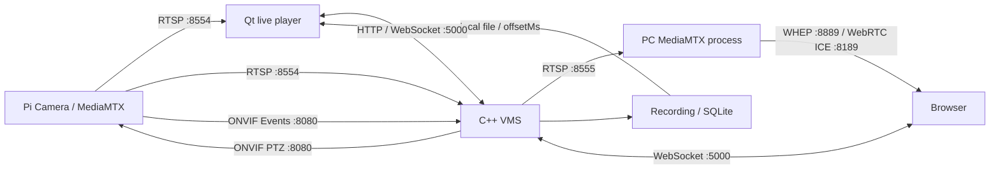

# 현재 라이브 영상 경로 (2026-10-10)

사용자 요청으로 Qt 라이브는 카메라 직접 RTSP, Web 라이브는 VMS 경유 WebRTC로 변경했다. Pi 코드는 변경하지 않았다.



## Qt 직접 URI

`GET /api/v1/cameras/{cameraId}/direct-stream?transport=tcp|udp`

응답: `data.cameraId, ready, protocol="rtsp", source="camera", transport, uri, codec, width, height, fps`.
uri는 기존 ONVIF GetStreamUri 결과이다. 원본 query를 변경하지 않으며 Qt UI의 transport를 FFmpeg backend에 적용한다. 직접 URI 준비는 등록 여부로 판단하고 VMS relay IDR 준비를 기다리지 않는다. 현재 Qt 상태/제어 연결은 VMS 카메라 상태를 계속 사용한다.

원본 URI에 필요한 URL-encoded RTSP 인증이 포함될 수 있다. camera list/status/broadcast에는 원본 URI를 넣지 않는다. Qt 표시·복사·tooltip은 userInfo를 제거하고 RTSP/Qt 진단 로그를 숨긴다. 비밀번호를 문서에 쓰지 않는다. 이 API는 localhost 개발용이며 외부 접근 인증/TLS는 별도 과제이다.

기존 `/api/v1/cameras/{id}/stream`은 VMS relay URI를 계속 반환한다. source="vms"가 추가된다. 게이트웨이는 이 relay를 읽으며 Pi에 직접 연결하지 않는다.

## Web URI

같은 `/ws`에서 `GET_WEB_STREAM` + cameraId를 요청한다.

```json
{"version":1,"type":"response","requestId":"web-1","ok":true,"data":{"cameraId":"CAM01","protocol":"webrtc","source":"vms","uri":"http://127.0.0.1:8889/CAM01/whep","ready":true,"gateway":"mediamtx"}}
```

예시는 형식 설명이다. `ready`는 VMS ingest/relay 준비만 의미한다. 게이트웨이 실행·ICE 성공·디코딩 성공을 보장하지 않는다. Web은 실제 decoded frame 증가 뒤 LIVE로 표시한다. gateway 미설정이면 WEBRTC_NOT_CONFIGURED이다. snapshot의 EXTERNAL_GATEWAY_CONFIGURED도 실행 확인 상태가 아니다.

Web에서 Pi WHEP 입력·fallback을 제거했다. 이전 localStorage의 whepUrl도 사용하지 않는다. 탐지/채팅 검색 결과의 재생 버튼·GET_EVENT_PLAYBACK 요청·재생 위치 표시를 제거하고 녹화 제어·목록 조회는 유지했다. Qt의 녹화 재생은 그대로 유지한다.

## PC 게이트웨이 실행

VMS 설정:

```ini
webrtc_gateway_url=http://127.0.0.1:8889
```

기본 공개 설정은 미설정이고 cam01.local.conf에 적용했다. PC MediaMTX는 C++ 서버 내부 SDK가 아닌 별도 프로세스이다. 기존 H.264를 재인코딩 없이 재사용한다.

```sh
# 최초 한 번: 공식 v1.21.2 x64 실행 파일 다운로드 및 고정 SHA256 검증
python3 tools/mediamtx_gateway.py --install --platform linux
python3 tools/mediamtx_gateway.py --install --platform windows

# Linux / WSL 브라우저
python3 tools/mediamtx_gateway.py

# Windows 브라우저 + WSL VMS: Windows MediaMTX 사용
python3 tools/mediamtx_gateway.py --platform windows
```

Windows에서는 `tools/run-web-gateway.cmd`로 실행할 수 있다. Python이 VMS local 설정의 relay bind/port와 camera ID만 gateway 구성에 사용한다. binary와 JSON 설정은 ignored build/gateway 아래에 둔다. camera가 추가되면 `--camera CAM01 --camera CAM02`처럼 등록 ID를 지정해 gateway를 다시 실행한다.

기본은 같은 PC 전용: HTTP 8889, ICE UDP/TCP 8189, loopback bind, 읽기만 허용. VMS relay가 WSL IP에 bind되어 있으면 gateway도 그 주소로 연결한다. 다른 PC/외부 브라우저의 public host·TLS·TURN·접근 권한은 별도 구성이다.

공식 근거: [MediaMTX 설정](https://mediamtx.org/docs/references/configuration-file), [WebRTC codec/연결 제약](https://mediamtx.org/docs/features/webrtc-specific-features). H.264 B-frame 등 브라우저 비호환 stream을 자동 재인코딩하지 않는다.

## 검증

- VMS 직접 URI/source/transport, 원본 인증 broadcast 비노출, Web gateway URI 및 잘못된 설정을 자동 검증한다.
- Qt 직접 REST 계약·인증 제거 표시, 기존 UI·검색·로컬 녹화 재생을 Linux/Windows에서 검증한다.
- Web 최신 API·저장된 Pi WHEP 무시·재생 UI 제거를 Playwright로 검증한다.
- `tests/gateway_integration.py`는 합성 H.264 RTSP → 실제 VMS relay → 실제 PC MediaMTX → Chromium WebRTC를 연결한다. 1280×720의 29 decoded frames와 browser 오류 0개를 확인했다.
- Pi 실물 이동·탐지·장시간 시험은 자동 실행하지 않았다. 실제 Qt 직접 TCP/UDP와 Web PC gateway 영상의 장비 시험은 사용자가 수행한다.
