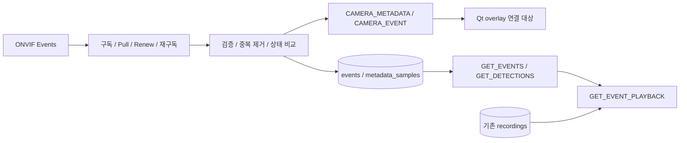

# 사람 탐지 metadata와 녹화 검색

## 확인 근거와 구현 순서

기존 Digest/SOAP, RTSP ingest, MKV/MP4 remux, recordings SQLite, WebSocket을 재사용한다.
EventManager/PlaybackManager는 인터페이스만 있었다. Qt 실제 overlay는 아직 Dummy 경로이다.
2026-10-09 SSH 읽기 검토로 `/root/ptz_project`의 `docs/EDGE_CAMERA_IMPLEMENTATION.md`,
`common/metadata/detection_metadata.h`, `pi/onvif_service/src/events/event_service.cpp`,
`event_broker.cpp`, `pi/camera_stream/src/main.cpp`를 확인했다.
아래 매핑과 시각 의미는 이 소스에 근거한다. 설치된 ONVIF 바이너리와 프로젝트 빌드 파일은
해시/시각이 다르므로 운영 응답의 지원 여부는 별도 확인해야 한다. Pi 수정·재시작·실물·장시간 시험은
하지 않았다. localhost fixture만 자동 실행하며 푸시는 별도 승인 후 진행한다.



1. 독립 Events 수신 worker와 GetEventProperties/구독/갱신/해제.
2. nullable metadata, 상태 변경 저장, 중복 제거, 실시간 알림.
3. 기존 recordings와 연결하여 segment/offset/정확도 반환.
4. fixture 검사 후 사용자 실물 시험.

PTZ와 long-poll worker를 공유하지 않는다. 카메라별 수신 worker(기존 최대 16개)와
하나의 bounded 이벤트/DB worker를 사용한다. SQLite는 같은 WAL 파일의 별도 연결을 소유한다.

## 시간 규칙

- DB/API는 UTC epoch milliseconds. 표시만 로컬 시간으로 변환한다.
- ONVIF Message UtcTime은 Pi ONVIF broker의 이벤트 생성 시각이다.
- VMS 수신 시각은 별도 저장한다. 누락/잘못된 원본 시각을 덮어쓰지 않는다.
- CaptureUnixMs는 GStreamer PTS 나이를 뺀 추정 UTC이며 센서 노출 시각이 아니다. 0은 null.
- AnalysisUnixMs는 추론 결과 생성 UTC이다.
- FramePtsNs는 publisher running time ns이다. -1은 null이며 VMS 영상 PTS와 바로 대응하지 않는다.
- FrameId는 분석 샘플 순번이다. StreamEpoch와 함께 사용하며 센서 전체 프레임 번호가 아니다.
- frameId/streamEpoch/framePtsNs/generation은 JS 정밀도 손실 방지를 위해 십진 문자열로 전달한다.
- GetSystemDateAndTime으로 측정한 차이는 NTP 동기화의 보장이 아니다.
- 현재 녹화 UTC는 첫 keyframe VMS 수신 시각, 파일 시간은 첫 DTS를 빼서 재기준화한다.
- 신규 recording_time_anchors에 첫 PTS/DTS/timebase/수신 UTC를 기록한다. 기존 녹화는 legacy이다.
- 정확한 capture UTC ↔ PTS 근거는 없다. offset은 항상 receive_estimated이다.
- 정확한 capture UTC/PTS anchor가 없으므로 기본 재생 불가. allowEstimated=true로만
  수신 시각 기반 탐색을 허용한다. 모터/프레임 정확도를 추정해서 표시하지 않는다.
- 파일이 없거나 완료되지 않았거나 범위 밖이면 playable=false. 범위는 [start,end)이다.
- Qt는 offsetMs로 seek하고 추정 탐색임을 표시한다. 원격 파일 전달은 이번 범위가 아니다.

## DB와 metadata

events: id, camera_id, type, source_time_ms(nullable), received_time_ms, search_time_ms,
confidence(nullable), payload_json, dedup_key(unique).

event_states: camera/topic/profile의 마지막 상태. 재구독 초기 상태를 등장으로 저장하지 않는다.

metadata_samples: camera_id, source_time_ms(nullable), received_time_ms, payload_json.
sampling 주기 0은 sample 저장을 끈다. 모든 bbox를 영구 저장하지 않는다.

detection_index: sample_id, camera_id, search_time_ms, confidence(nullable).
현재 저장하는 Detected=true 샘플만 색인한다. 이전 metadata_samples를 자동으로 해석·backfill하지 않는다.
보존 정책으로 삭제된 sample의 색인도 정리한다.

recording_time_anchors: recording_id, arrival_utc_ms, first_pts/dts, time_base_num/den.
기존 recordings와 파일 형식은 유지한다.

선택적 confidence/bbox/기준 영상 크기/tracking/pan·tilt 명령 각도/frameId/frame 시각은
실제 응답에 존재하는 경우만 저장한다. Pi 매핑이 기본 내장되어 있고 설정으로 덮어쓸 수 있다.
누락은 null. rawItems는 실제 값만 포함한다.
normalized PTZ를 각도로 변환하거나 bbox 단위를 추측하지 않는다.
Initialized는 baseline이며 등장 이벤트가 아니다. 단절을 PERSON_LOST로 만들지 않는다.
GetEventProperties에 Runtime/StateEvent가 선언되면 그 Type의 PERSON_DETECTED/PERSON_LOST/
TRACKING_STARTED/TRACKING_STOPPED를 저장한다. property로 같은 변경을 다시 저장하지 않는다.
해당 토픽이 없으면 Changed의 Detected/Enabled 변화를 사용한다(property_fallback).
Pi는 같은 topic의 Changed를 최신 property로 합치므로 fallback은 짧은 등장/이탈을 놓칠 수 있다.
Runtime/StateEvent는 Type만 제공한다. confidence/bbox/각도를 인접 샘플에서 추측하여 붙이지 않는다.
confidence 검색은 실제 탐지 샘플 GET_DETECTIONS를 사용한다.
원본 시각이 이전인 property snapshot은 다시 적용하지 않는다. runtime 발생 기록은 순서가 달라도 저장한다.
같은 ms의 다른 Type/값은 구분한다. 시각 없는 동일 payload는 보수적으로
중복 제거하므로 서로 다른 발생을 구별하지 못할 수 있다. NTP 시각 역행·장치 재부팅 시에는
이벤트 연속성을 보장하지 않는다. 원본 시각을 가진 실제 payload로 확인해야 한다.

## 설정과 API

events_enabled=false가 기본. 실물 시험에서 true로 켠다.
events_pull_seconds/events_message_limit/events_retry_ms/metadata_sample_ms/
metadata_retention_days/event_retention_days로 수신·저장·보존 정책을 설정한다.
events_field_map은 논리 필드→Pi SimpleItem 이름 JSON이며 빈 객체는 내장 Pi 매핑을 사용한다.
Pull seconds는 1..10, MessageLimit는 1..64로 시작 시 검증한다. 기본값은 5초/32개다.

| Pi 필드 | VMS JSON |
|---|---|
| Detected / Enabled / Available | detected / tracking / available |
| Confidence | confidence |
| BoxX / BoxY / BoxWidth / BoxHeight | bboxX / bboxY / bboxWidth / bboxHeight |
| ImageWidth / ImageHeight | imageWidth / imageHeight |
| PanAngle / TiltAngle | panCommandAngle / tiltCommandAngle (명령 각도) |
| FrameId / StreamEpoch / FramePtsNs / Generation | frameId / streamEpoch / framePtsNs / generation (문자열) |
| CaptureUnixMs / AnalysisUnixMs | captureTimeMs / analysisTimeMs (UTC ms) |
| CaptureTimeSource | captureTimeSource (pts-estimated 또는 unknown) |
| Type | eventType |
| TargetState / AutoAllowed / Mode / Moving / Fault | targetState / autoAllowed / ptzMode / moving / fault |

```json
{"version":1,"requestId":"e1","command":"GET_EVENTS","cameraId":"CAM01","fromMs":0,"toMs":1900000000000,"types":["PERSON_DETECTED"],"limit":50}
{"version":1,"requestId":"d1","command":"GET_DETECTIONS","cameraId":"CAM01","fromMs":0,"toMs":1900000000000,"minConfidence":0.8,"limit":50}
{"version":1,"requestId":"p1","command":"GET_EVENT_PLAYBACK","eventId":1,"allowEstimated":true}
{"version":1,"requestId":"p2","command":"GET_EVENT_PLAYBACK","sampleId":1,"allowEstimated":true}
```

GET_EVENTS 응답 data.events/nextCursor. searchTimeMs/id keyset pagination이다.
다음 페이지에서도 동일 조건을 사용한다. confidence null은 최소 confidence 조건에 포함하지 않는다.
GET_DETECTIONS 응답 data.detections/nextCursor. 각 row는 recordKind=detection_sample,
type=DETECTION_SAMPLE, id/sampleId와 실제 metadata를 포함한다. 반복 bbox는 sampling 정책으로 제한한다.
검색 시각은 captureTimeMs → analysisTimeMs → broker sourceTimeMs → receivedTimeMs 순으로 선택한다.
이 시각들은 원본 UTC이며 시계 offset을 검색 결과에 몰래 적용하지 않는다. Pi/VMS NTP 동기화가 필요하다.
GET_EVENT_PLAYBACK은 eventId 또는 sampleId 중 하나를 받아 cameraId/playable/reason/recording/
offsetMs/timeMapping/captureTimeMs/analysisTimeMs를 반환한다. ID 종류를 섞지 않는다.
녹화 lookupTimeMs는 VMS 수신 시각을 사용하며 capture UTC의 정확한 영상 정렬이라고 주장하지 않는다.
Qt는 playable=false이면 재생 불가 표시, estimated이면 추정 탐색 표시 후 로컬 파일을 연다.
VMS 파일 스트리밍/다운로드 API를 새로 만들지 않는다.

CAMERA_METADATA: nullable 실시간 값과 source/received 시각.
CAMERA_EVENT: 저장된 상태 변경. EVENT_RECEIVER_STATUS: 수신 상태/지원 필드.
Qt 클라이언트에 알림을 기존 setDetection overlay로 연결했다. nullable 필드와 영상 기준 크기를 유지하며 2초간 새 bbox가 없으면 제거한다. EVENTS에서 상태 이력/탐지 샘플을 검색하고 서버가 반환한 offsetMs로 로컬 녹화 파일을 재생한다. 실제 Pi 연동 시험은 아직 남아 있다.

## 사용자 실물 시험 절차

1. 로컬 설정 `config/cam01.local.conf`의 계정을 유지하고 `events_enabled=true`를 추가한다.
   같은 key를 중복해서 추가하지 않는다. events_pull_seconds=5가 기본이다.
2. VMS 실행 후 Qt에서 기존 ONVIF 카메라 등록을 수행한다.
3. VMS 폴더에서 아래 관찰 도구를 수동 실행한다. Pi/PTZ 명령은 보내지 않는다.

```sh
python3 tests/watch_events.py --camera CAM01 --seconds 30
```

4. EVENT_RECEIVER_STATUS와 실제 수신 필드 이름을 확인한다. 사람 등장/이탈, tracking 전환은 사용자가 수행한다.
5. transitionSource=runtime 또는 property_fallback을 확인한다. 기본 Pi 상세 필드는 자동 매핑된다.
6. 녹화 시작 → 탐지 → 녹화 정지 후 GET_EVENTS/GET_DETECTIONS/GET_EVENT_PLAYBACK으로 완료 파일을 확인한다.
7. network-enabled 개발 환경에서 `ctest --test-dir build --output-on-failure`로 localhost fixture 테스트를 실행한다.

네트워크 허용 후 localhost의 legacy/runtime ONVIF Events fixture와 기존 RTSP·녹화·PTZ 등을 포함한
CTest 10개가 통과했다. Pi의 실제 서비스에 구독·이동·추적·녹화 시험을 자동 실행한 결과는 아니다.

## 다른 프로젝트에서 할 일

### Pi 담당

- 설치 바이너리와 소스 빌드가 다른 이유 및 Runtime/StateEvent 운영 지원을 확인한다.
- 배포가 필요하면 사용자 승인 후 적용한다. VMS가 Pi 서비스를 재설치/재시작하지 않는다.
- tracking OFF에서도 탐지가 필요하면 detectionWhenDisabled 정책을 설정·검증한다. 기본 false이다.
- Pi와 VMS NTP/UTC를 확인한다. CaptureUnixMs가 추정 시각임을 유지한다.
- 구독 queue는 최대 64개이고 Runtime/StateEvent에도 영속 로그/발생 ID가 없다.
  통신 단절/overflow의 완전 복구가 필요하면 Pi 쪽 eventId·epoch 또는 replay 계약이 추가로 필요하다.

### Qt 구현 완료 · 실물 검증 대상

- CAMERA_METADATA의 topic별 nullable 값을 병합한다. 다른 topic의 null로 detection을 지우지 않는다.
- Analytics/PersonDetection의 bbox와 imageWidth/imageHeight로 기존 overlay에 연결한다.
- Detected=false 또는 Available=false면 bbox를 지운다. PTZ 각도는 실측 위치라고 표시하지 않는다.
- frameId/streamEpoch/framePtsNs/generation은 문자열로 보존한다. double로 바꾸지 않는다.
- 상태 이력은 GET_EVENTS, confidence 기반 사람 탐지 기록은 GET_DETECTIONS로 검색한다.
- row.recordKind에 따라 eventId 또는 sampleId를 선택해 GET_EVENT_PLAYBACK을 호출한다.
- playable=false면 재생을 막고, receive_estimated이면 추정 탐색임을 표시하며 offsetMs로 seek한다.
- 원격 파일 다운로드 기능은 아직 없으므로 기존 로컬 playback 경로를 사용한다.

### 사용자의 실물 시험

사람 등장/이탈, 빠른 재등장, tracking ON/OFF, 통신 단절·재연결, segment 경계,
미녹화 시각, confidence 검색, 실제 영상/overlay 정렬을 확인한다. 장시간 시험도 사용자가 수행한다.
