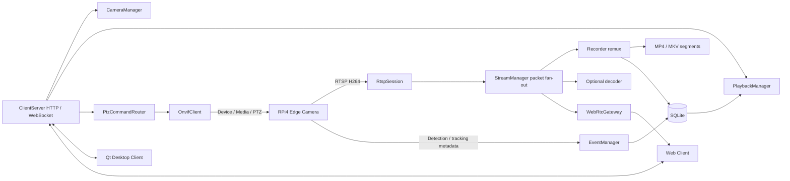

> 추가 후속: 사용자 요청 2·3번인 stream REST endpoint와 VMS-managed RTSP relay를 구현했다.
> [RTSP_RELAY_API.md](RTSP_RELAY_API.md)에 현재 기능/제한을 정리했다.
> 기존 WS list/status 알림은 유지하며 camera list/status REST는 이번 범위에 포함되지 않는다.
> Relay compile/link 및 기본 unit 확인 완료, 실제 재생 검증은 보류했다.

> 2026-10-07 사용자 요청 후속: WebSocket client API를 추가 구현했다.
> 현재 GET_CAMERA_LIST/GET_CAMERA_STATUS와 CAMERA_STATUS snapshot 알림이 동작하며,
> Qt Client의 VmsClient와 실제 연결된다. 구체적인 실행/API/제한은
> [WEBSOCKET_API.md](WEBSOCKET_API.md)를 따른다. 아래 M1 분석은 초기 단계 기록이다.

# Mini VMS Server architecture

작성일: 2026-10-07. C++17 / CMake. Qt GUI가 아닌 독립 서버 프로세스.

## 1. 현재 repository 분석

분석 시작 시 `/mnt/c/PTZ_VMS_Server`는 빈 디렉터리였다. Git metadata, 소스,
CMakeLists, 기존 Qt/Raspberry Pi 코드, dependency manifest, AGENTS.md가 없었다.
따라서 기존 기능과 재사용 가능한 코드가 없으며, Edge Camera 내부 구현과 기존
Qt Client protocol은 여기서 확인할 수 없다. 별도 저장소의 기능을 추정하지 않는다.

초기 실행 환경은 Linux/WSL 계열이며 GNU C++는 있었지만 CMake, pkg-config,
FFmpeg 개발 패키지가 없었다. 검증을 위해 이 환경에 CMake 및 FFmpeg 개발 패키지를
설치했다. Windows native compiler/SDK 실행 검증은 이 환경에서 수행할 수 없다.

문제점은 실행 가능한 기반과 module contract가 모두 없다는 것이다. 목표 전체 구조와의
차이는 M2~M9가 전부 미구현이라는 점이다. 아래에 정의한 미래 모듈은 순수 가상
interface이며 기능이 성공한 것처럼 동작하는 stub을 제공하지 않는다.

## 2. 시스템과 범위



RPi가 capture, OpenCV DNN, tracking, GPIO18 PAN/GPIO19 TILT PWM, RTSP server,
ONVIF Device/Media/PTZ와 metadata 송신을 담당한다. VMS에 GPIO/OpenCV tracking을
복제하지 않는다. 모든 client 제어 요청은 VMS를 경유한다.

**현재 M1:** 단일 camera 설정을 읽고, H.264 RTSP 연결/packet 수신/정보 출력/
재연결/안전한 종료만 수행한다. Frame display, decode pipeline, recording, SQLite,
ONVIF 통신, client port, WebRTC session, web UI는 실행되지 않는다.
`avformat_find_stream_info`가 codec 정보 추출 과정에서 내부적으로 일부 frame을
probe할 수 있지만 continuous decode/encode나 transcoding pipeline은 만들지 않는다.

## 3. Dependencies와 build

| 단계 | Dependency | 역할 / 결정 |
|---|---|---|
| M1 | C++17, CMake >=3.16, Threads | console server와 worker lifecycle |
| M1 | libavformat, libavcodec, libavutil | RTSP demux, AVPacket, codecpar, error와 rational |
| 선택 검증 | Python3 | 표준 라이브러리만 사용하는 로컬 RTSP fixture |
| M2 | 위 FFmpeg 라이브러리 | stream copy mux; 추가 encoder 필요 없음 |
| M3 | SQLite3 | camera / segment / event 저장 |
| 이후 decode | libswscale | AVFrame 색상/크기 변환이 필요할 때만 링크 |
| M6 | ONVIF adapter, SOAP/XML, HTTP, WS-Discovery UDP | Pi의 실제 WSDL/service 구현 확인 후 선정 |
| M7 | Boost.Asio/Beast 또는 standalone networking | HTTP + WebSocket; QtNetwork 사용하지 않음 |
| M8 | 별도 WebRTC adapter/service | 현재 추가하지 않음 |

현재는 avformat/avcodec/avutil만 링크한다. 사용하지 않는 SQLite/swscale/Boost/
WebRTC를 설치하거나 vendor하지 않는다. FFmpeg 6.1.1 Linux SDK로 빌드 검증하며,
최신 공식 API 문서에 존재하는 `codecpar`, `av_packet_alloc/free/unref`,
`avformat_open_input`, `avformat_find_stream_info`, `av_read_frame`,
`avformat_close_input`, `AVIOInterruptCB`를 사용한다. Deprecated API를 compilation
error로 처리한다. 버전별 옵션과 실제 SDK 호환성은 dependency update 시 재검증한다.

Linux:

```sh
sudo apt-get install cmake g++ pkg-config libavformat-dev libavcodec-dev libavutil-dev
cmake -S . -B build -DCMAKE_BUILD_TYPE=Debug
cmake --build build --parallel
ctest --test-dir build --output-on-failure
./build/vms-server --config config/vms.conf
```

Windows (PowerShell, VS 2022 C++ tools / CMake, x64 FFmpeg **development** shared SDK):

```powershell
cmake -S . -B build-win -G "Visual Studio 17 2022" -A x64 -DFFMPEG_ROOT="C:/deps/ffmpeg"
cmake --build build-win --config Release
$env:PATH = "C:\deps\ffmpeg\bin;" + $env:PATH
.\build-win\Release\vms-server.exe --config config/vms.conf
ctest --test-dir build-win -C Release --output-on-failure
```

SDK에는 `include/libavformat/avformat.h`, avformat/avcodec/avutil import `.lib`와
그에 대응하는 DLL들이 있어야 한다. CLI-only FFmpeg 배포판으로는 build할 수 없다.
MSVC/MinGW의 toolchain과 x64/x86 ABI를 혼합하지 않는다. 모든 dependent DLL은
PATH 또는 exe 디렉터리에서 로드 가능해야 한다. 이 find module은 shared SDK와
Linux pkg-config 기반 설치를 대상으로 한다. Static FFmpeg의 transitive system
libraries는 별도 toolchain 설정이 필요하다. 플랫폼 코드는 logger의 localtime 함수와
Windows console SIGBREAK 지원 정도로 제한한다.

## 4. Directory structure

저장소 루트 자체가 `vms-server/` 프로젝트다. 불필요한 하위 root를 만들지 않는다.

```text
CMakeLists.txt
cmake/FindFFmpeg.cmake
include/
  core/Config.h, Logger.h, Result.h
  camera/CameraInfo.h, CameraManager.h
  stream/RtspSession.h, StreamManager.h
  recording/Recorder.h, PlaybackManager.h
  event/DetectionEvent.h, EventManager.h
  database/DatabaseManager.h
  onvif/OnvifClient.h
  ptz/PtzCommandRouter.h
  client/ClientServer.h
  webrtc/WebRtcGateway.h
src/
  main.cpp
  core/Config.cpp, Logger.cpp
  stream/RtspSession.cpp, StreamManager.cpp
config/vms.conf
data/
recordings/
tests/unit_tests.cpp, rtsp_integration.py, fixtures/sample.h264
docs/VMS_ARCHITECTURE.md
```

M2~M9 구현 파일은 해당 module `src/` 디렉터리에 단계별로 추가한다.

## 5. Class responsibility / contract

| Class | 책임 | 현재 상태 |
|---|---|---|
| StreamConfig / loadConfig | cameraId, RTSP URL, transport, timeout, retry, 통계 주기 검증 | M1 구현 |
| StreamManager | cameraId별 session 소유; start/stop/status; shutdown 시 먼저 모두 취소 후 join | M1 구현 |
| RtspSession | RTSP worker, FFmpeg input/packet 소유, stream 정보/packet callback, 재연결 | M1 구현 |
| CameraManager | 등록/삭제/조회/status, discovery 결과 등록; stream/event와 연결 | M3 interface |
| Recorder | codecpar 복사, packet timestamp 변환, keyframe segment remux, finalization | M2 interface |
| DatabaseManager | SQLite open/migration, camera/recording/event CRUD와 시간 query | M3/M4 interface |
| EventManager | metadata validation, persist 후 client publish | M4 interface |
| PlaybackManager | cameraId + UTC 시각의 segment 조회 | M5 interface |
| OnvifClient | discovery, info, capabilities, profiles, URI, PTZ, status | M6 interface |
| PtzCommandRouter | cameraId lookup, profile 선택, PTZ 범위 검증, ONVIF dispatch | M6 interface |
| ClientServer | HTTP/WS endpoint, auth, request validation, notification | M7 interface |
| WebRtcGateway | camera live session, packet input, client/SDP/ICE lifecycle | M8 interface |

Interface 조회 실패는 exception; optional의 nullopt는 결과 없음만 뜻한다.
`Result`를 반환하는 command는 `ok/error`로 실패를 전달한다. 외부 API에서는 이를
일관된 error response로 매핑한다. 미래 async execution에서는 result를 future나
completion handler로 돌려주며 blocking interface를 RTSP/network thread에 호출하지 않는다.

ONVIF profile token은 명령에 명시적으로 포함한다. ONVIF normalized coordinate와
MG90S degree를 혼동하지 않는다. CameraManager/Main에 SOAP 코드를 섞지 않는다.
Tracking ON/OFF는 ONVIF 표준 PTZ 명령이 아니므로 Pi 전용 metadata/control protocol을
합의하고 별도 adapter로 구현한다. 현재 interface가 tracking 제어를 성공시키지 않는다.

## 6. M1 data flow와 ownership

1. Main은 strict `key=value` configuration을 읽는다. duplicate/unknown key,
   잘못된 protocol/transport/timeout/camera ID는 startup failure다.
2. Network RAII scope가 FFmpeg network runtime을 초기화한다.
3. StreamManager는 cameraId로 RtspSession을 소유한다. M1 configuration은 한 대만
   지원하지만 map과 callback에 ID를 전달하여 multi-camera 확장 경계를 유지한다.
4. Worker는 CONNECTING → input open → stream probe → video 선택을 수행한다.
5. H264 codec, resolution, FPS(알 수 없으면 unknown), time base를 출력한다.
6. 정상 video AVPacket을 받으면 ONLINE으로 전환한다. bytes/packet/dropped 통계를
   주기적으로 출력한다. Corrupt flag/empty packet은 downstream으로 전달하지 않는다.
7. `onStream` / `onPacket`은 지금 optional extension point다. 기본 실행은 수신하고
   해제한다. callback은 worker에서 호출하므로 짧게 실행해야 한다.
8. `AVFormatContext*` / `AVPacket*`는 **callback 동안만** 유효하다. 비동기 소비자는
   av_packet_ref/clone과 avcodec_parameters_copy, time_base 복사로 독립 소유해야 한다.
   Reconnect마다 stream metadata를 갱신한다. inputContext를 recorder thread에 보관하지 않는다.
9. EOF, socket error, timeout, callback exception은 session을 정리한 뒤 ERROR /
   retry로 이어진다. stop이면 retry 없이 OFFLINE으로 종료한다.

Input context, option dictionary, packet은 각각 destructor에서 해제한다. Open 실패 시
FFmpeg가 context pointer를 null로 바꾸는 경우도 처리한다. packet은 매 수신 후 unref,
exception/shutdown 시 free한다. Network deinit은 모든 session join 뒤에 수행한다.
FFmpeg log는 URL credentials를 노출할 수 있어 quiet로 설정하고 자체 cameraId 기반
로그를 남긴다. 로그 시각은 PC local time; DB 시각은 UTC로 설계한다.

## 7. Thread model / synchronization

**M1:** main은 signal flag를 50 ms 주기로 확인하고 lifecycle을 제어한다. 카메라당
RTSP worker 하나만 생성한다. Blocking FFmpeg I/O는 worker에서 실행한다.
SIGINT/SIGTERM handler는 `volatile sig_atomic_t` flag만 설정한다. Handler 안에서
mutex, log, FFmpeg, join을 호출하지 않는다. Main이 atomic stop request를 전달한다.

`AVIOInterruptCB`는 steady_clock deadline과 atomic stop을 확인한다. Open/probe는
connect timeout, packet wait는 read timeout으로 제한한다. 정상 video packet 수신 시
read deadline을 갱신하므로 audio packet 또는 EAGAIN이 video stall을 감추지 않는다.
FFmpeg 지원 protocol의 callback polling과 network/DNS 동작에 따라 정확한 종료 시간은
달라질 수 있다. 운영 환경의 이름 해석/Windows SDK에서도 종료 상한을 검증해야 한다.
재연결은 fixed delay + condition_variable이고 stop이 즉시 깨운다.

- packet/context/deadline은 worker 전용: mutex가 필요 없다.
- status/stop은 atomic: main의 조회/취소와 worker 간 공유.
- condition_variable 대기는 mutex와 stop predicate를 함께 사용하여 lost wakeup 방지.
- logger mutex는 console 출력을 직렬화한다.
- StreamManager map은 main/control thread 전용. 향후 HTTP handler에서 직접 만지지 않고
  control executor에 command를 post한다.

**M2 이후 제안:**

| Worker / executor | 역할 | Queue / synchronization |
|---|---|---|
| Main/control | 등록/삭제/session 소유/status 반영 | control mailbox; map 단일 소유 |
| RTSP per camera | 수신, packet reference fan-out | 짧은 enqueue만 수행 |
| Recording per active camera, 필요 시 shared pool | disk mux와 segment close | bounded packet FIFO; stream-open/reset/close도 동일 FIFO |
| DB single worker | SQLite connection, transaction, 조회 | bounded job queue, 완료 결과로 reply |
| Network 1~2 executor threads | HTTP/WS async I/O | session별 ordered write queue |
| ONVIF small bounded executor | SOAP/discovery timeout | camera별 command ordering; STOP 우선 처리 |
| WebRTC module/service | RTP/ICE/DTLS/SRTP | bounded live queue; session별 lifecycle |

Queue는 packet 개수뿐 아니라 byte 상한도 둔다. Recording queue overflow는 silently
성공으로 처리하지 않는다: segment를 실패/불완전 상태로 닫고 누락 구간을 기록하며
다음 keyframe에서 재개한다. Live queue는 오래된 packet을 제거하고 다음 IDR을 기다려
latency와 decoder resync를 보장한다. DB queue full은 producer에 실패를 전달한다.
처음부터 모든 worker를 생성하지 않는다. 카메라 수/throughput 측정 후 pool을 결정한다.

Shutdown은 network 새 요청 차단 → RTSP stop/join → recorder queue drain/trailer →
DB job drain/close → WebRTC/ONVIF executor 종료 → network runtime 해제 순서다.

## 8. Recording / playback / time model (M2~M5)

기본 segment duration은 600초. `recordings/CAM01/YYYY-MM-DD/HH-MM-SS.mkv` 또는
`.mp4`를 사용하며 날짜/파일명 기준 timezone을 명시한다. 파일명 충돌은 unique suffix로
방지한다. M2에서는 crash recovery가 쉬운 MKV를 우선 검증하고 MP4는 trailer/fMP4
정책을 선택한다. 일반 MP4는 crash 시 moov 미작성으로 재생 불가할 수 있다.

codecpar를 output stream에 복사하고 PTS/DTS/duration을 output time_base로 rescale한다.
기준 timestamp offset을 제거하되 B-frame의 PTS/DTS 관계를 유지한다. audio는 최초
단계에 제외하고 video stream_index만 mapping한다. codec/extradata가 바뀌거나 reconnect
하면 새 segment를 시작한다. H.264 Annex B/AVCC 및 필요한 bitstream filter를 container에
맞춰 검증한다. decode→encode 하지 않는다. segment 전환은 duration 이상인 다음 IDR에서
수행해 각 파일의 독립 재생을 보장하므로 실제 길이는 GOP에 따라 600초를 초과할 수 있다.

Wall clock와 RTSP PTS는 동일하지 않다. Segment 시작 시 server UTC와 stream PTS anchor를
함께 기록하고 Pi event timestamp는 명시적 UTC offset/epoch를 받는다. Pi/PC NTP sync,
수신 timestamp, clock skew를 보관한다. Events의 capture time과 arrival time을 구별한다.
M5 `findRecording(cameraId, timestamp)`는 completed segment에 대해
`start_time <= t AND t < end_time` (반개구간)을 조회한다. gap이면 없음, 여러 후보는
정해진 우선순위로 선택한다. Seek offset은 t-start와 PTS mapping으로 계산하며 초기에는
파일 검색까지만 제공한다.

## 9. SQLite schema proposal

M3에서 versioned migration과 prepared statement, transaction, foreign key를 사용한다.
시각은 UTC epoch milliseconds INTEGER로 저장하고 UI만 local time으로 변환한다.

- `cameras`: id TEXT PK, name, ip, rtsp_url, onvif_url, username, password/credential_ref,
  status. Runtime status는 시작 시 OFFLINE으로 초기화한다.
- `recordings`: id INTEGER PK, camera_id FK, start_time, end_time, file_path UNIQUE,
  duration, codec, width, height. `state`, start_pts, time_base, clock anchor는 M2/M3에서
  검증해 추가한다. Finalization 성공 이후 completed로 표시한다.
- `events`: id INTEGER PK, camera_id FK, timestamp, type, confidence,
  bbox_x/y/width/height, error_x/y, pan_angle, tilt_angle. receive_time/skew는 필요 시 추가.
- Index: recordings(camera_id,start_time,end_time), events(camera_id,timestamp).

DB 파일은 data/vms.db. WAL/busy_timeout/디스크 부족을 검증한다. 삭제는 녹화/event
이력을 보존하는 정책을 먼저 정하고 camera deregister와 파일 삭제를 분리한다. 비밀번호는
client list/status에 반환하지 않는다. 현재 M1에는 credentials DB가 없다. M3에서 Windows
credential store/Linux secret storage 여부를 결정하여 평문 저장을 최소화한다.

Event validation: 존재하는 cameraId, 명시적 timezone timestamp, 알려진 type,
finite confidence 0..1, bbox 크기/범위, finite pan/tilt/error, payload 크기와 query limit.
BBox는 알려진 video resolution 기준으로 검사한다. PERSON_LOST/connection event처럼
bbox가 의미 없는 event는 schema nullability를 정한다. DB commit 후에만 client에
persisted event를 publish한다. 중복 송신은 Pi event ID를 합의해 deduplicate한다.

## 10. Client API comparison / proposal

| 선택 | 장점 | 비용 |
|---|---|---|
| 자체 TCP protocol | 단순 Qt prototype, framing 제어 | browser 직접 연결 불가; framing/version/auth를 직접 설계 |
| HTTP + WebSocket | Qt/Web 공통, query/command와 push 분리 | HTTP routing/JSON/WS session 관리 필요 |

M7은 HTTP + WebSocket을 제안한다. Boost.Beast/Asio를 우선 평가하되 기존 client와
배포 환경 확인 후 확정한다. camera/status/event/recording 조회는 HTTP, PTZ 명령과
live session 생성/해제는 HTTP command 또는 WS requestId가 있는 message,
status/event/SDP/ICE는 WS notification으로 정리한다. 초기 API map:

- GET_CAMERA_LIST / GET_CAMERA_STATUS → `/api/cameras`, `/api/cameras/{id}/status`
- START_LIVE / STOP_LIVE → camera live session create/delete
- PTZ_MOVE / PTZ_STOP → camera PTZ command, movement mode/units 명시
- TRACKING_ON / TRACKING_OFF → Pi tracking adapter
- GET_EVENTS / GET_RECORDINGS → UTC from/to + pagination/limit

모든 결과에 cameraId와 requestId/errorCode를 제공한다. Camera credentials는 내부에만
보관한다. Live endpoint가 camera RTSP URL을 browser/client에 넘기지 않는다. Qt live video
transport도 VMS relay로 결정해야 하며 M7에서 합의한다. M1의 callback 자체는 relay가 아니다.
외부 노출 전 authentication, authorization, TLS/CORS 및 rate limit을 정한다.
M7 이전에는 listening client port가 없다.

## 11. WebRTC comparison / implementation direction

| 선택 | C++ FFmpeg server 적합성 | 부담 / tradeoff |
|---|---|---|
| Native libwebrtc | C++에서 직접 peer/media control; 별도 service 불필요 | 전용 checkout/toolchain/build와 adapter 유지 비용, 큰 dependency |
| GStreamer webrtcbin | C API와 RTP/H264 pipeline 구성이 자연스러움 | FFmpeg 외 미디어 runtime/plugins 추가, 이중 pipeline/Windows packaging |
| Pion external service | C++ VMS와 packet/control boundary로 분리; Go WebRTC SDK | Go binary/IPC 배포, process health 관리, IPC overhead |

현재 저장소에 GStreamer/libwebrtc 기반이 없으므로 **Pion external service를 M8의 우선
구현 후보로 제안**한다. 이는 architecture 판단이며 SDK를 설치하거나 최종 구현을
확정한 것이 아니다. C++ 단일 binary 배포가 필수라면 libwebrtc나 별도 lightweight native
adapter를 다시 평가한다. GStreamer 기존 환경이 생기면 webrtcbin의 우선순위가 올라간다.

M8 gate: 실제 Pi SPS/PPS/profile-level-id, packetization-mode, IDR cadence, browser별
H.264 decode 호환성, bitrate, RTCP feedback/PLI→Pi keyframe 요청, ICE/STUN/TURN,
SDP/ICE signaling, reconnect/IPC backpressure, 배포 binary 크기, latency 측정.
FFmpeg AVPacket을 WebRTC에 그대로 쓸 수 있다고 가정하지 않는다. NAL parsing,
Annex B/AVCC 변환, RTP timestamp 90kHz mapping, FU-A fragmentation, SPS/PPS와
keyframe bootstrap, pacing, SRTP transport가 필요하다. B-frame/profile이 browser와
맞지 않으면 Pi encoder 설정을 우선 조정하고, transcoding 필요 여부를 명시적으로 결정한다.
현재 WebRtcGateway는 packet/client/offer/ICE 경계만 선언한다. SDP answer/ICE outbound
sink와 external service IPC protocol은 M8 spike 이후 구체화한다.

## 12. Error handling / logging

| 상황 | 처리 |
|---|---|
| RTSP disconnect / camera off / timeout | ERROR, context 정리, reconnect; 한 camera가 server를 종료하지 않음 |
| corrupt/empty packet | drop + counter; 장시간 정상 packet 없음은 timeout/retry |
| ONVIF timeout | command error와 requestId 회신; RTSP worker에 영향 없음 |
| recording disk full/mux failure | segment failed, 경고 event; ingest/live 유지; 성공 metadata 금지 |
| database error | job 실패, notification에서 persistence 실패 명시; bounded retry 정책 |
| client disconnect | session/queue 해제; PTZ continuous move deadman/STOP 정책 |
| WebRTC disconnect | client별 ICE/session 정리; RTSP 수명은 recorder/live reference 기준 |

로그: `[YYYY-MM-DD HH:MM:SS][CAM01][RTSP/REC/EVENT/ONVIF/SERVER] message`.
M1에서는 console만 사용한다. Packet마다 log하지 않고 통계를 일정 주기로 출력한다.
Packet 통계는 현재 session 누적 값이고 reconnect 시 초기화된다. recording/event/network
오류는 향후 같은 형식을 사용한다. Log sink 지연이 ingest를 막는 문제가 관측되면 bounded
async sink를 추가한다.

## 13. Milestone implementation plan / acceptance

| 단계 | 구현 | 완료 검증 |
|---|---|---|
| M1 현재 | config, FFmpeg RTSP packet ingest, info, RAII, interrupt/reconnect | H264 정보, 지속 packet, Ctrl+C, disconnect/stall/unreachable |
| M2 | Recorder worker, 600초 keyframe segment, stream copy MKV/MP4 | decode/encode 없음, independently playable files, reconnect/disk error |
| M3 | CameraManager + SQLite metadata, migrations | CAM01 등록/재시작/조회/status, completed segment query |
| M4 | Pi metadata transport/parser + EventManager | validation, persist/publish, timezone/clock/duplicate |
| M5 | PlaybackManager | event 시각 segment lookup, boundary/gap, seek mapping |
| M6 | ONVIF adapter + PTZ router | 실제 Pi discovery/capabilities/profile/URI/PTZ/timeout |
| M7 | Qt API, HTTP/WS, VMS live relay 결정 | client가 Pi 직접 연결하지 않음, status/event/PTZ/recording |
| M8 | WebRTC spike 후 gateway 구현 | H264 재사용, SDP/ICE/RTCP, measured low latency, disconnect |
| M9 | Web Client | VMS API + WebRTC live, PTZ, event/playback |

각 단계 완료 뒤 다음 단계에 들어간다. 이번 작업은 M1에 한정한다.

## 14. M1 tests and practical limits

`tests/unit_tests.cpp`는 config parsing/rejection, module header compilation,
없는 camera lifecycle 조회를 검증한다. `tests/rtsp_integration.py`는 ephemeral localhost
port의 RTSP/TCP server와 checked-in synthetic H264를 사용한다. Runtime test에는
FFmpeg CLI/외부 camera/Python third-party package가 필요 없다. Fixture는 시험 용도이며
상용 RTSP server 구현이 아니다. `tests/fixtures/sample.h264`는 FFmpeg lavfi blue frame과
libx264로 생성한 원본 테스트 자산(1280x720,25fps,1초,repeat headers/AUD)이다.

Tests: codec/resolution/FPS/time base, nonzero AVPacket 수신, connection drop와 reconnect,
media stall, active receive 종료, blocked handshake 종료, unreachable camera,
300000ms retry 대기 중 즉시 종료. Windows Python test는 process group + CTRL_BREAK를
사용하고 native console에서는 Ctrl+C(SIGINT)를 처리한다.

실제 Pi 주소의 연결 성공과 Windows console/SDK 동작은 해당 장비/환경에서 추가 확인해야
한다. 로컬 fixture 통과를 실제 카메라 검증으로 대신 보고하지 않는다. FPS 미제공 시
unknown 출력은 정상이다. M1은 packet reception이며 continuous decode나 corruption의
bitstream 전체 검증을 보장하지 않는다. Credentials가 포함된 config는 local 파일로 관리하고
저장소에 커밋하지 않는다.

## 15. Official references

- [FFmpeg demuxing API](https://ffmpeg.org/doxygen/trunk/group__lavf__decoding.html)
- [FFmpeg interrupt callback](https://ffmpeg.org/doxygen/trunk/structAVIOInterruptCB.html)
- [FFmpeg RTSP options](https://ffmpeg.org/ffmpeg-protocols.html#rtsp)
- [libwebrtc native development](https://webrtc.googlesource.com/src/+/main/docs/native-code/development/)
- [GStreamer webrtcbin](https://gstreamer.freedesktop.org/documentation/webrtc/)
- [Pion official project](https://github.com/pion/webrtc)

Architecture 선택과 worker/queue 설계는 위 기능 특성과 현재 빈 저장소를 바탕으로 한 제안이다.

## 16. 이번 작업의 실제 검증 결과

- Linux GNU 13.3 / FFmpeg 6.1.1 / CMake 3.28.3: Debug build 성공.
- CTest 2/2 통과 (unit + RTSP integration, 약 7초).
- 별도 `/tmp/mini-vms-asan` build의 AddressSanitizer + UndefinedBehaviorSanitizer +
  `ASAN_OPTIONS=detect_leaks=1`: 같은 테스트 2/2 통과, 검사 오류/누수 보고 없음.
  FFmpeg 공유 라이브러리 자체는 sanitizer로 재빌드하지 않았으므로 검사 범위에 제한이 있다.
- 기본 설정 `rtsp://192.168.0.92:8554/stream`으로 약 7초 실행 시
  `RTSP open failed: Server returned 400 Bad Request`가 반환되었다. 자동 재시도 후
  SIGINT로 `Shutdown complete`, exit code 0을 확인했다. 이 응답만으로 실제 Pi와의
  통신 여부/서비스 상태를 단정할 수 없으며, **실제 카메라 연결 성공은 미확인**이다.
- Windows native build와 실제 Pi 연속 수신 검증은 남아 있다. 현재 로컬 RTSP fixture의
  H264 수신/정보/장애/종료 완료를 실제 장비 검증과 구분한다.

Fixture 생성 명령 (재생성할 때만 FFmpeg CLI 사용; VMS와 테스트 실행에는 CLI 호출 없음):

```sh
ffmpeg -hide_banner -loglevel error -f lavfi -i color=c=blue:s=1280x720:r=25 -t 1 \
  -c:v libx264 -preset ultrafast -tune zerolatency \
  -x264-params 'keyint=10:repeat-headers=1:aud=1' -f h264 tests/fixtures/sample.h264
```

## 17. CAM01 후속 실제 장비 검증 (2026-10-07)

사용자가 제공한 정확한 RTSP path `/cam`과 계정으로 재검증하여 **실제 Pi 영상 수신에
성공**했다. H264 1280x720 30FPS, time_base 1/90000, 469 packets와 안전한 종료를 확인했다.
기본 설정의 path를 `/cam`으로 수정하고 인증 설정은 ignored local config에 저장했다.
ONVIF Device/Media/PTZ/Events 조회와 PullPoint 상태 event 수신도 별도 SOAP probe로 성공했다.
`GetStreamUri`의 StreamType 표기 호환성 차이를 발견했다.
세부 결과와 범위는 [CAM01_CONNECTION_TEST.md](CAM01_CONNECTION_TEST.md)에 기록했다.
C++ OnvifClient와 자동 카메라 등록 기능은 여전히 interface 단계다.
